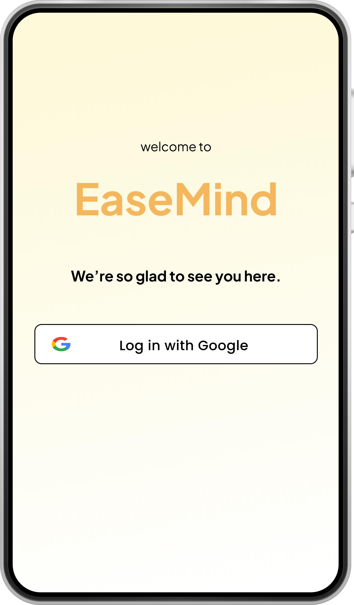
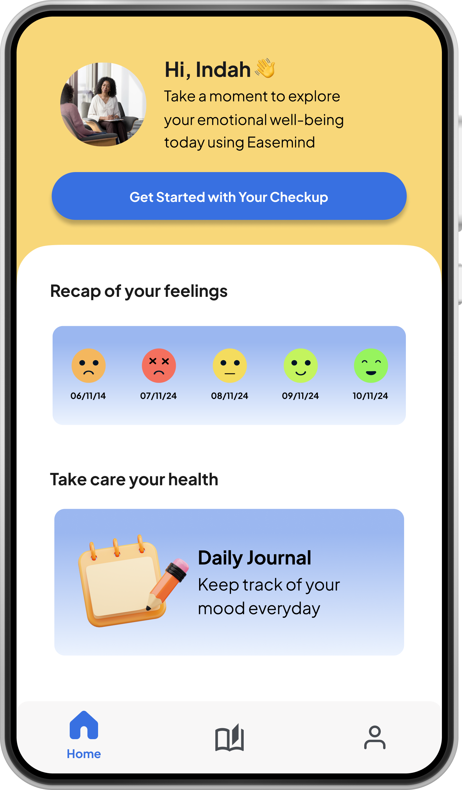
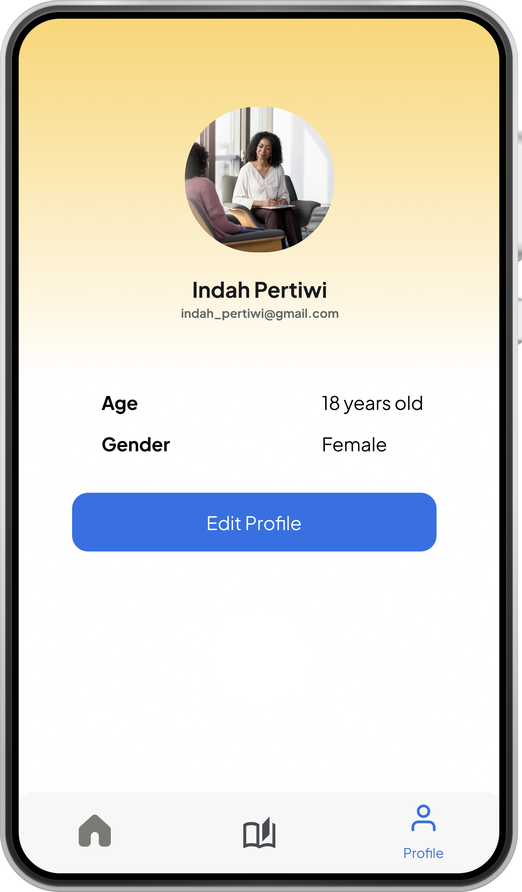
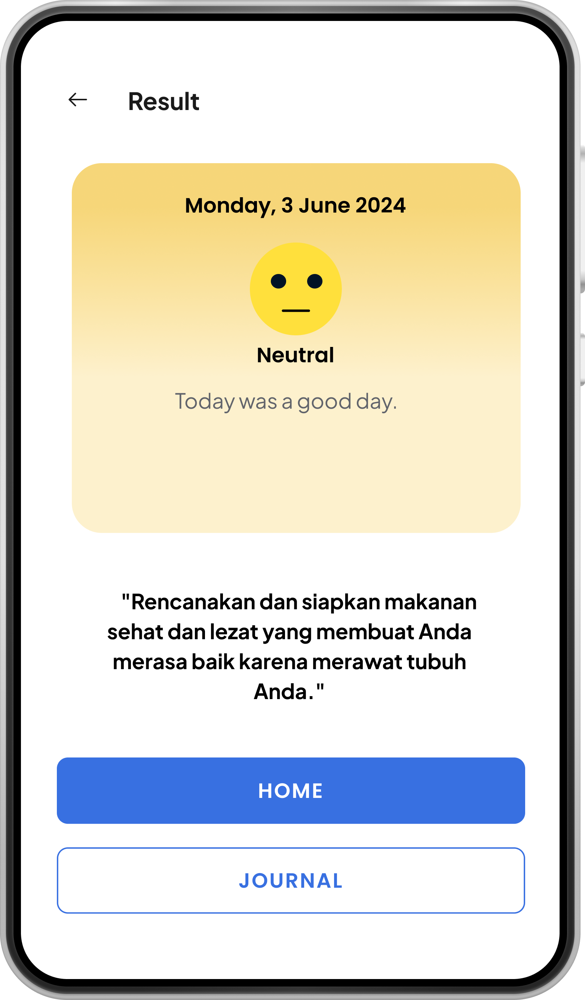
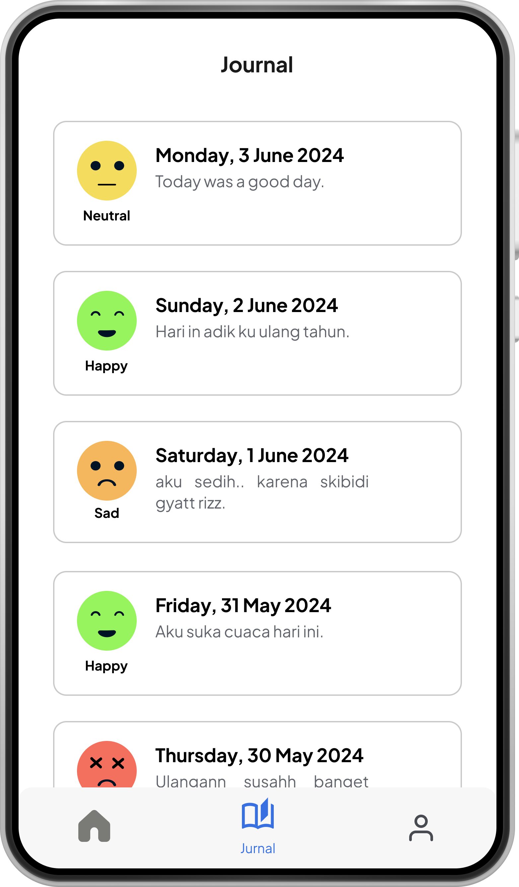
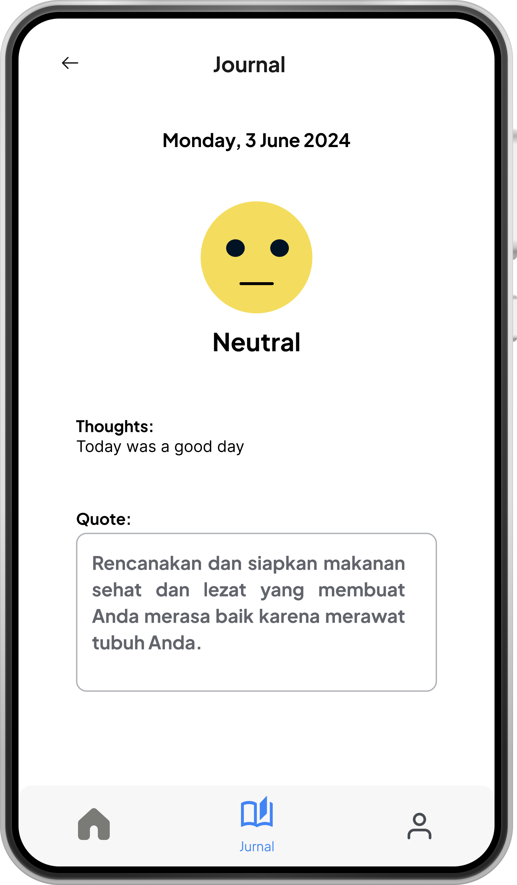

# Welcome to EaseMind!

## About Us 🤗
Dealing with stress and depression is tough, and existing tools often fall short of providing the personal touch people really need. Our mobile app is designed to uniquely assist individuals in managing their stress. We help users diagnose their mental state through analysis of facial expressions, and by asking simple questions related to BMI, feelings, mood, and thoughts. Based on this information, we provide personalized quotes and positive messages to uplift our users. Additionally, our app includes a daily journal feature to help users monitor their stress levels over time and identify triggers.

## Preview Application 📱
| Authentication       | Homepage                 | Profile                 |
|----------------------|--------------------------|-------------------------|
|  |  |  |

| Questionnaire                 | Journal                 | Detail Journal                 |
|-------------------------------|-------------------------|--------------------------------|
|  |  |  |

## Getting Started 📖
1. Make sure you have an Android phone.
2. Download from .apk file from this repository release section, or using this link.
3. In order to use scan garbage type feature, you need to give camera permission so our app can get image using your phone camera.
4. Don't forget to have proper internet connection so you don't have problem while making garbage order or taking garbage order.

## Mobile Tech Stack 😎
1. Kotlin
2. Tensor Flow Lite
3. Android Studio

## Wanna run this project locally? 💻
To run this project in your machine please follow this steps
1. Make sure in your computer already installed Android Studio
2. Clone this project
3. Run the application in your local machine
